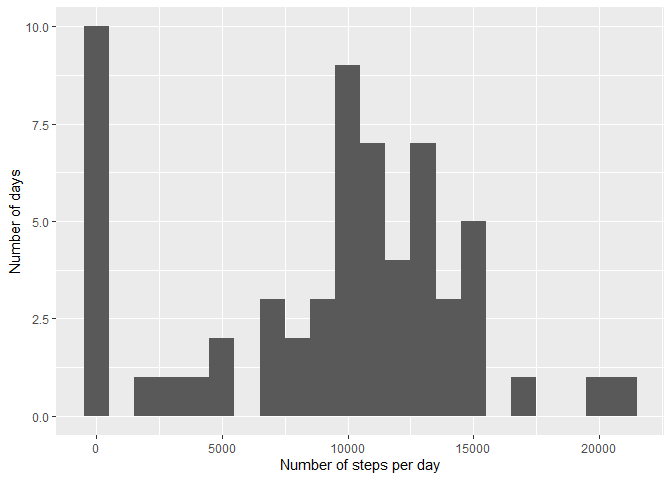
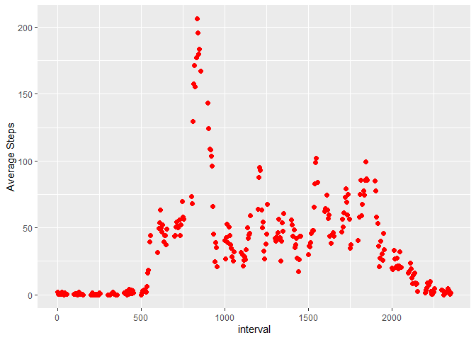
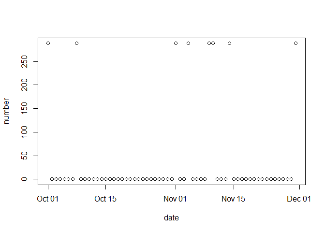
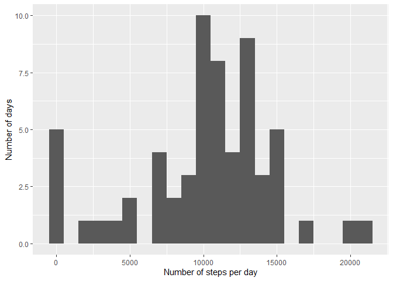
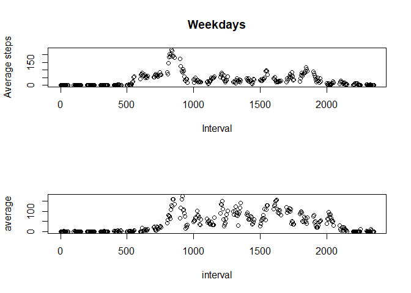

---
title: "Reproducible Research Assignment 1"
author: "Sugeet-m"
date: "2025-04-24"
output: html_document
---

## Activity Monitoring Data

### Step 1
Setting up the work environment and sourcing the data.


``` r
knitr::opts_chunk$set(echo = TRUE)

library(dplyr)
```

```
## 
## Attaching package: 'dplyr'
```

```
## The following objects are masked from 'package:stats':
## 
##     filter, lag
```

```
## The following objects are masked from 'package:base':
## 
##     intersect, setdiff, setequal, union
```

``` r
library(ggplot2)

fileurl <- "https://d396qusza40orc.cloudfront.net/repdata%2Fdata%2Factivity.zip"
download.file(fileurl, destfile = "./data.zip", method = "curl")
unzip("./data.zip", exdir = "./")
```

### Step 2
Reading the data and examining the contents.


``` r
list.files()
```

```
## [1] "activity.csv"                 "activity.zip"                
## [3] "data.zip"                     "doc"                         
## [5] "instructions_fig"             "PA1_template.html"           
## [7] "PA1_template.Rmd"             "README.md"                   
## [9] "ReproducibleData_Peer1.Rproj"
```

``` r
data <- read.csv("activity.csv")
str(data)
```

```
## 'data.frame':	17568 obs. of  3 variables:
##  $ steps   : int  NA NA NA NA NA NA NA NA NA NA ...
##  $ date    : chr  "2012-10-01" "2012-10-01" "2012-10-01" "2012-10-01" ...
##  $ interval: int  0 5 10 15 20 25 30 35 40 45 ...
```

### Step 3
Calculating the daily mean and median number of steps and plotting the histogram.


``` r
data$date <- as.POSIXlt(data$date) ## needed to group by date
daily <- data %>% group_by(date) %>% 
        summarize(DailySteps = sum(steps, na.rm = TRUE))
g <- ggplot(data = daily, aes(x = DailySteps))
g + geom_histogram(binwidth = 1000) + 
    labs(x = "Number of steps per day", y = "Number of days")
```

<!-- -->

``` r
meansteps <- mean(daily$DailySteps)
mediansteps <- median(daily$DailySteps)
```
The daily mean and median number of steps are 9354.2295082 and 10395, 
respectively. 

### Step 4
Plotting the average of the number of steps in each 5-minute interval to 
highlight any patterns in activity and reporting the interval with the maximum 
average number of steps. 


``` r
interval <- data %>% group_by(interval) %>% 
    summarize(int_av = mean(steps, na.rm = TRUE))
g2 <- ggplot(data = interval, aes(x = interval, y = int_av))
g2 + geom_point(color = "red", cex = 2) + 
    labs(x = "interval", y = "Average Steps")
```

<!-- -->

``` r
minutes <- data %>% group_by(interval) %>% 
    summarize(AverageSteps = sum(steps, na.rm = TRUE))
fiveminute <- as.character(minutes[which.max(minutes$AverageSteps),1])
```

The interval with the highest number of average steps is 835.

### Step 5
Examining source data for missing values and imputing missing data.


``` r
missingvalues <- sum(is.na(data$steps))
```
The number of missing values in the dataset is 2304.

The data were examined to assess if there were any patterns in the missing data.
It was found that the data were missing for entire days. For readability of the
documents, the other lines of investigation are not presented.


``` r
missingdates <- data %>% group_by(date) %>% 
    summarize(number = sum(is.na(steps)))
plot(missingdates)
```

<!-- -->

A simple strategy was used to impute the missing data. Missing values were
replaced with the number of steps taken in the corresponding interval of the 
next day for which data are available (note that there are consecutive days for
which data are missing). The data for the last day in the dataset were also 
missing and these were replaced with the data from the previous day.

This strategy was used to avoid the use of specialized packages which I am not
familiar with.


``` r
imputed_data <- data

for(i in 1:17280)
{	if(is.na(imputed_data[i,1]))
	{	j <- i+288
		k <- 1+576
		if(!is.na(imputed_data[j,1]))
		{	imputed_data[i,1] <- imputed_data[j,1]
		}
		else
		{	imputed_data[i,1] <- imputed_data[k,1]
		}
	}
}	

for(i in 17281:17568)
{	l <- i-288
	imputed_data[i,1] <- imputed_data[l,1]
}

imputed_daily <- imputed_data %>% group_by(date) %>% 
    summarize(DailySteps = sum(steps))

g3 <- ggplot(data = imputed_daily, aes(x = DailySteps))
g3 + geom_histogram(binwidth = 1000) + 
    labs(x = "Number of steps per day", y = "Number of days")
```

<!-- -->

### Step 6
Examining differences in activity between weekdays and weekends.
For this analysis, the original dataset (without imputed values) was used.


``` r
library(timeDate)
dayofweek <- data

dayofweek$date <- as.Date(dayofweek$date) ## required to use timeDate::isWeekend
dayofweek$IsWeekend <- isWeekend(dayofweek$date)

weekdays <- subset(dayofweek, IsWeekend == 0)
weekends <- subset(dayofweek, IsWeekend == 1)

weekdays_av <- weekdays %>% group_by(interval) %>% 
    summarize(average = mean(steps, na.rm = TRUE))
weekends_av <- weekends %>% group_by(interval) %>% 
    summarize(average = mean(steps, na.rm = TRUE))

par(mfrow = c(2,1))
plot(weekdays_av, xlab = "Interval", ylab = "Average steps", main = "Weekdays")
plot(weekends_av)
```

<!-- -->

From this panel plot, it can be seen that there some clear differences between
the activity patterns for weekdays and weekends. For example, activity increases
more slowly in the morning and continues later into the evening on weekends
compared to weekdays.

### Thank you
